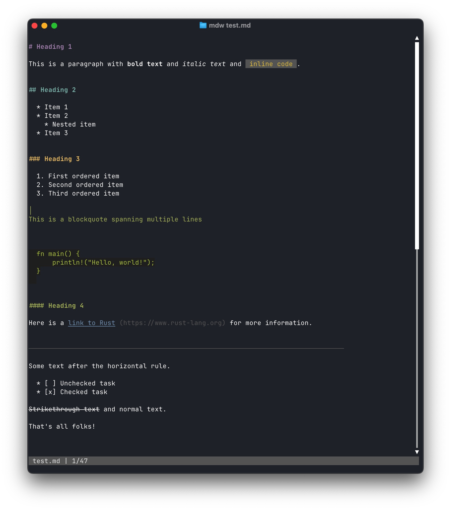

<p align="center">
  
</p>

<p align="center">
  A terminal markdown viewer with live reload, built with Rust.
</p>

---

## Screenshot



## Features

- Syntax-highlighted markdown rendering in the terminal
- Live reload — file changes are reflected instantly
- Vim-style keybindings (`j`/`k`, `g`/`G`, `ctrl+d`/`ctrl+u`, ...)
- Fully configurable keybindings, theme colors, and behavior via TOML
- Scrollbar and status bar

## Installation

### Homebrew

```sh
brew tap shonenada/tap
brew install shonenada/tap/mdw
```

### Shell script

```sh
curl -fsSL https://raw.githubusercontent.com/shonenada-vibe/mdw/main/scripts/install.sh | bash
```

To install a specific version:

```sh
curl -fsSL https://raw.githubusercontent.com/shonenada-vibe/mdw/main/scripts/install.sh | bash -s -- v0.1.0
```

To install to a custom directory:

```sh
MDW_INSTALL_DIR=~/.local/bin curl -fsSL https://raw.githubusercontent.com/shonenada-vibe/mdw/main/scripts/install.sh | bash
```

### From source

```sh
cargo install --path .
```

## Usage

```sh
# View a markdown file
mdw README.md

# Set up a config file
mdw config setup
```

## Configuration

Run `mdw config setup` to generate a default config at `~/.config/mdw/config.toml`.

All options are commented out by default — uncomment and edit to customize. mdw works out of the box with sensible defaults.

### Keybindings

```toml
[keybindings]
quit = ["q", "ctrl+c"]
scroll_down = ["j", "down"]
scroll_up = ["k", "up"]
half_page_down = ["ctrl+d"]
half_page_up = ["ctrl+u"]
page_down = ["ctrl+f", "pagedown"]
page_up = ["ctrl+b", "pageup"]
top = ["g", "home"]
bottom = ["shift+g", "G", "end"]
```

Key format: `"key"`, `"ctrl+key"`, `"shift+key"`, `"alt+key"`. Special keys: `up`, `down`, `pageup`, `pagedown`, `home`, `end`, `esc`, `enter`, `space`, `tab`.

### Theme

```toml
[theme]
heading1 = "magenta"
heading2 = "cyan"
heading3 = "yellow"
heading4 = "green"
heading5 = "blue"
heading6 = "white"
code_block_fg = "lightgreen"
code_block_bg = "#282828"
inline_code_fg = "lightyellow"
inline_code_bg = "darkgray"
blockquote = "green"
link = "blue"
link_url = "darkgray"
horizontal_rule = "darkgray"
status_bar_bg = "darkgray"
status_bar_fg = "white"
status_bar_message_fg = "yellow"
```

Colors can be named (`red`, `lightblue`, `darkgray`, ...) or hex (`#rrggbb`).

### Behavior

```toml
[behavior]
line_wrap = true
debounce_ms = 200
scroll_speed = 1
```

| Option | Description | Default |
|---|---|---|
| `line_wrap` | Wrap long lines | `true` |
| `debounce_ms` | File watcher debounce interval (ms) | `200` |
| `scroll_speed` | Lines to scroll per `j`/`k` press | `1` |

## License

MIT
