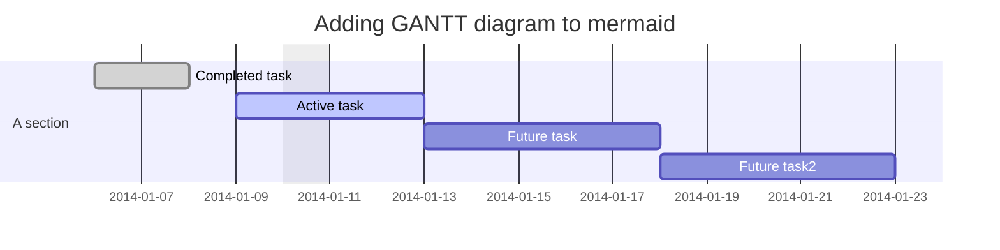
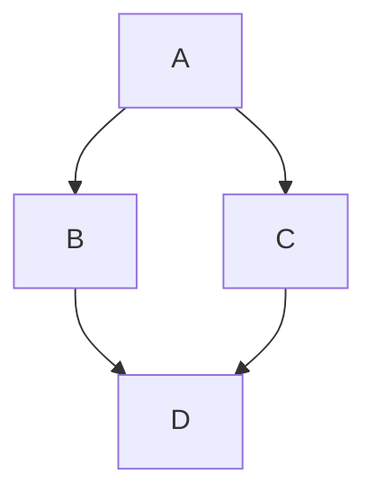

Gantt:


```mermaid
gantt
dateFormat  YYYY-MM-DD
title Adding GANTT diagram to mermaid
excludes weekdays 2014-01-10

section A section
Completed task            :done,    des1, 2014-01-06,2014-01-08
Active task               :active,  des2, 2014-01-09, 3d
Future task               :         des3, after des2, 5d
Future task2               :         des4, after des3, 5d
```

TD:


```mermaid
graph TD
    A-->B
    A-->C
    B-->D
    C-->D
```

D2:

```d2
x -> y: hello world
```

```d2
Write Replica Canada <-> Write Replica Australia

Read Replica <- Master
Write Replica -> Master

Read Replica 1 -- Read Replica 2
```
